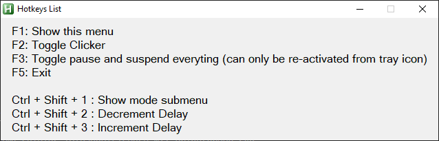

# Auto Clicker

[![GitHub Release][github_release_badge]][github_release_link]
[![License][license-image]][license-url]

An auto hotkey script that rapidly clicks at the pointer location. Also includes windows notifications, adjustable speed, and a help menu.

## How To Use

you can access the following menu after launching the script by holding `F1`:

## How To Run

1. Download [AutoHotkey](https://www.autohotkey.com/)
2. Double click [autoclick.ahk](autoclick.ahk)

## Authors

* **Mohamed Said Sallam** - Main Dev - [TheDigitalPhoenixX](https://github.com/TheDigitalPhoenixX)

See also the list of [contributors][github-contributors] who participated in this project and their work in [CONTRIBUTORS.md](CONTRIBUTORS.md).

## License

This project is licensed under the MIT License - see the [LICENSE](LICENSE) file for details

## Acknowledgments

* [README.md Template](https://gist.github.com/PurpleBooth/109311bb0361f32d87a2)

[license-image]: https://img.shields.io/badge/License-MIT-brightgreen.svg
[license-url]: https://opensource.org/licenses/MIT

[github_release_badge]: https://img.shields.io/github/v/release/TheDigitalPhoenixX/AutoHotkey-Auto-Clicker.svg?style=flat&include_prereleases
[github_release_link]: https://github.com/TheDigitalPhoenixX/AutoHotkey-Auto-Clicker/releases

[github-contributors]: https://github.com/TheDigitalPhoenixX/AutoHotkey-Auto-Clicker/contributors
[github-tags]: https://github.com/TheDigitalPhoenixX/AutoHotkey-Auto-Clicker/tags
